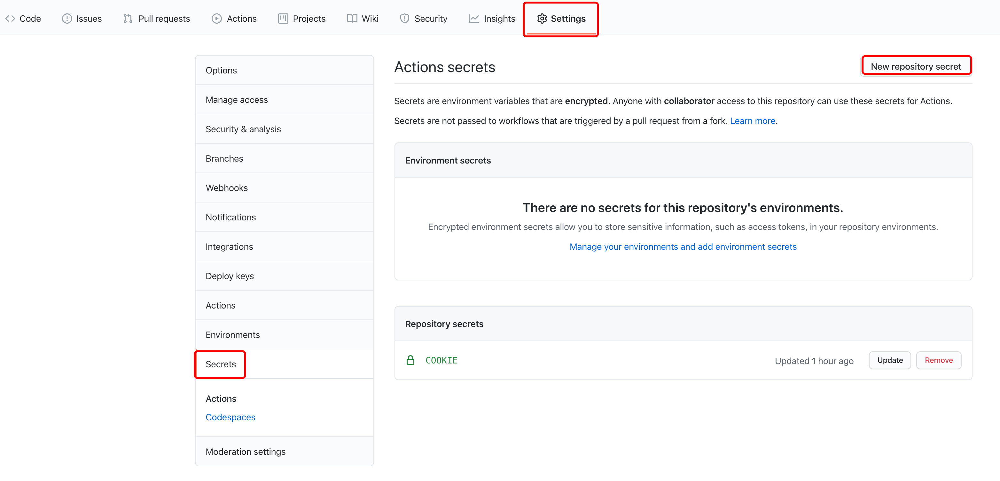

# 咪咕爱看签到

APP 接口改了。但原来的也还能用。不能用的时候就更新一下 COOKIE。

一点小羊毛。**好哥哥们顺手点个 star 吧。**

通过 github action 来实现自动签到（每天 50M 流量，每隔 5 天 0.38 元话费）

## 步骤

### 1 fork 这个仓库

点击右上角的 fork。

### 2 获取 cookie

通过抓包咪咕爱看签到的请求，获取 cookie，其实只需要 cookie 中的 mToken 这个值就好了。

### 3 设置 cookie

在 fork 后**自己的**仓库中依次点击 `Settings` - `Secrets` - `New repository secret`，如下图所示：



然后添加一个名为 `COOKIE` 的变量，内容为获取到的 cookie，类似于 `mToken=...`。

`COOKIE` 示例：

```text
mToken=eyJ0aW1lc3RhbXAiOjE2MTA3MTExMTM2MDQsInJvd1Rva2VuIjoiOWVkOGUwZTVlMjimOGRmZDE5N2Y4ZGJmOWYwMWQ1ODYiLCJ1aWQiOjMxoD1yOTUsInVzZXJOYW1lIjoiIiwibW9iaWxlIjoiMTUwNTg0ODU0ODgizCJ1c2VyUG9ydHJhaXQiOiIiLCJleHRlbmQiOiJ7XCJtb2JpbGVUeXBlXCI6XCIwXCJ1IiwiZGV2aWNlSWQiOiI3MzIxOTExmDY2MzQ2YzA5MWEzNjQwZjk0YTk3MzgxMSIsImNsaWVudFZlcnNpb24iOiI0LjquNCIsImRldmljZU1vZGVsIjaiaVBob25lIFgiLCJndWVzdCI6ZmFsc2UsInNpZ24iOiJjYjFlNzM0Y2NmYzExYTc2MWE4NGY1NDBhZmQ5YjE3MyJ9
```

### 4 运行

随便发起一个 push 请求，可以修改一下 `README.md`，或者自己给自己点个 star，就可以开始。之后就会每小时进行一次签到（因为有时候签到会失败，好像是服务器不太好，就设置一下每小时签到一次保证成功吧）。

注意，在官方文档中有这么一段：

> To prevent unnecessary workflow runs, scheduled workflows may be disabled automatically. When a public repository is forked, scheduled workflows are disabled by default. In a public repository, scheduled workflows are automatically disabled when no repository activity has occurred in 60 days.

也就是说，**定时执行的任务需要每隔 60 天激活一次**。

